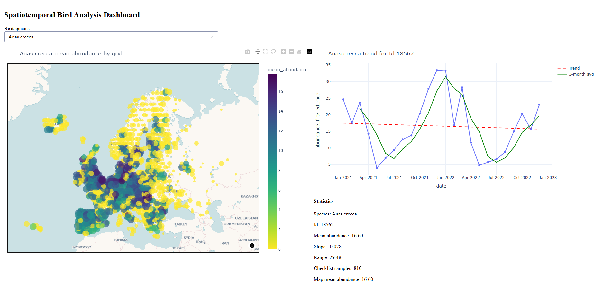
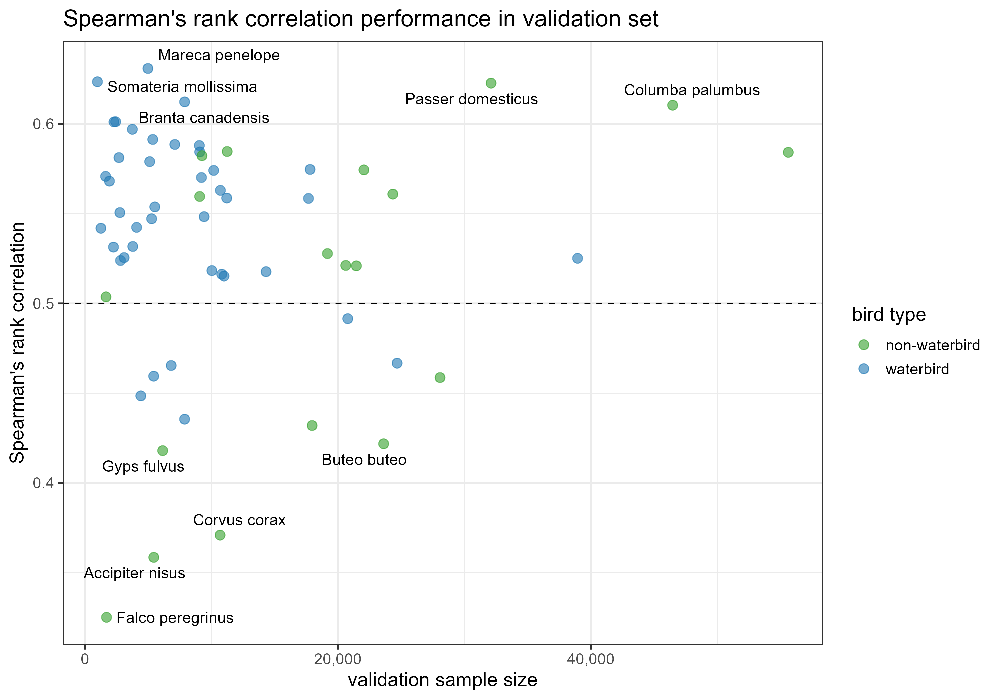
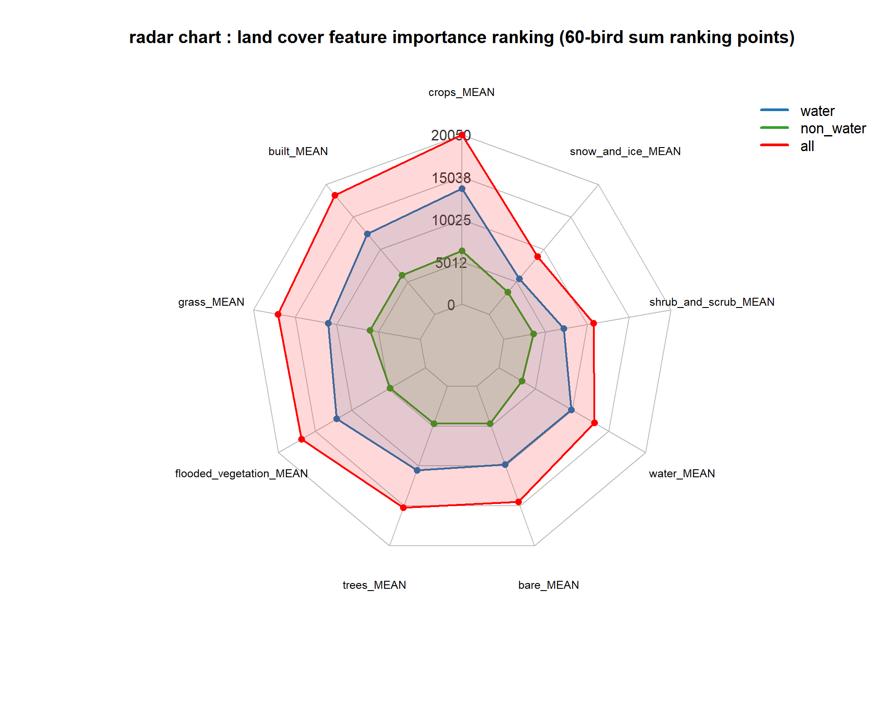
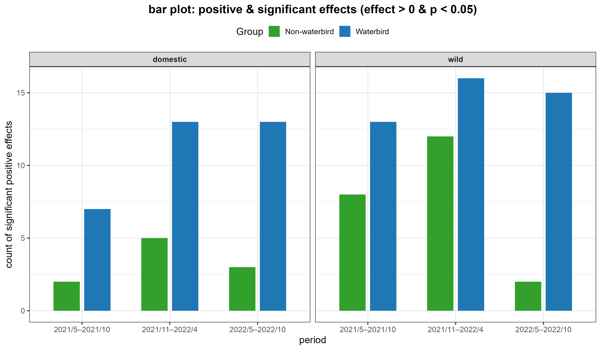
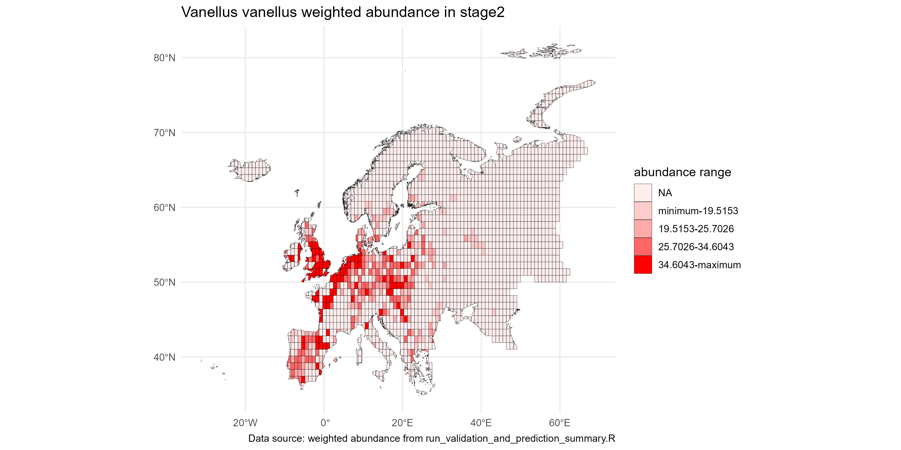

# eu-aiv-analysis

CLI-based workflow for:

1. Bird abundance model training and prediction
2. Validation / ensemble post-processing
3. AIV analysis
4. Land-cover imputation
5. Interactive Plotly dashboard

The project has been reorganized so the main analyses can be run from the terminal without editing paths in the original scripts.

## Example Dashboard



## Important Path Rule

You may rename the repository folder after cloning or downloading it.

For example, these are all acceptable:

```text
abundance_r_test/
bird_project_2026/
my_local_bird_repo/
```

What must stay unchanged is the **internal relative folder structure**.

In other words:

- The CLI scripts do **not** require the root folder to be named `abundance_r_test`
- The CLI scripts **do** expect sibling folders such as `gee_data/`, `EU_100km_fishnet_simple_by_distance/`, `ebird_filtered_checklist/`, and output folders to remain in the expected relative locations

Example:

```text
bird_project_2026/
├─ run_land_cover_imputation.R
├─ gee_data/
└─ EU_100km_fishnet_simple_by_distance/
```

This works because the script uses its own file location as the base directory.

## Data Download

Large data files are not stored directly in this GitHub repository because of GitHub file size limits.

Download the required data from Google Drive:

[Google Drive folder](https://drive.google.com/drive/folders/1YX5561Yos3P4PsK1OfChdaQ7mAzx2Ihm)

After downloading:

1. Extract the zip files.
2. Place the extracted folders under the project root.
3. Keep the internal relative folder structure unchanged.

## Project Structure

```text
eu-aiv-analysis/
├─ run_abundance_prediction.R
├─ run_validation_and_prediction_summary.R
├─ run_aiv_analysis.R
├─ run_land_cover_imputation.R
├─ Plotly_Dashboard.py
├─ bird_species_list.csv
├─ bird_type_lookup.csv
├─ README_plotly_dashboard.md
├─ gee_data/
│  ├─ era5_2016_2022/
│  ├─ land_cover_2016_2022.csv
│  └─ EU_2016_2022_land_cover_and_climate_data_containing_missing_values.csv
├─ EU_100km_fishnet_simple_by_distance/
├─ ebird_filtered_checklist/
├─ abundance_spatiotemporal_sampling_method/
├─ validation_data/
├─ validation_prediction_summary/
├─ aiv_fixed_data/
├─ livestock_density_10km/
├─ aiv_analysis/
└─ land_cover_imputation/
```

Notes:

- `abundance_spatiotemporal_sampling_method/`, `validation_data/`, `validation_prediction_summary/`, `aiv_analysis/`, and `land_cover_imputation/` are output folders.
- `.venv_plotly_dashboard/` is a local Python virtual environment and usually should not be uploaded to GitHub.

## Recommended Environments

### R

- Recommended version: `R 4.3.3`
- Tested version: `R 4.3.3`

All command examples in this README use `Rscript`.

If `Rscript` is not available in your terminal `PATH`, use the full executable path instead, for example:

```powershell
& "C:\Program Files\R\R-4.3.3\bin\Rscript.exe" ".\run_land_cover_imputation.R" --help
```

Required R packages:

```r
install.packages(c("sf", "dplyr", "zoo", "xgboost", "pbapply", "data.table"))
```

Additional packages are required by the abundance / AIV scripts depending on the workflow. If a script reports a missing package, install it in the same R environment.

### Python

- Recommended version for dashboard: `Python 3.12`

Suggested virtual environment setup:

```powershell
py -3.12 -m venv ".venv_plotly_dashboard"
& ".\.venv_plotly_dashboard\Scripts\Activate.ps1"
python -m pip install --upgrade pip setuptools wheel
python -m pip install numpy pandas plotly dash geopandas shapely pyogrio fiona
```

## Workflow Overview

The main workflow is:

1. `run_abundance_prediction.R`
   Generate species-level abundance predictions.
2. `run_validation_and_prediction_summary.R`
   Combine iterations, compute validation metrics, export MAD-filter abundance, and generate maps.
3. `run_aiv_analysis.R`
   Use MAD-filter abundance outputs for Wild / Domestic AIV analysis.
4. `Plotly_Dashboard.py`
   Explore abundance results interactively.

The land-cover imputation workflow is independent:

1. `run_land_cover_imputation.R`
   Sampling -> imputation -> aggregate

## 1. Abundance Prediction CLI

Script:

- `run_abundance_prediction.R`

Purpose:

- Train abundance models for one, many, or all bird species
- Use checklist, environmental, and land-cover inputs
- Export model outputs under `abundance_spatiotemporal_sampling_method/`

### Help

```powershell
Rscript ".\run_abundance_prediction.R" --help
```

### Common examples

Single species:

```powershell
Rscript ".\run_abundance_prediction.R" --species "Anas crecca"
```

Single species with custom settings:

```powershell
Rscript ".\run_abundance_prediction.R" `
  --species "Anas crecca" `
  --n-iter 5 `
  --obs-quantile-cutoff 0.98 `
  --observer-quantile-cutoff 0.7 `
  --grid-quantile-cutoff 0.5
```

All species:

```powershell
Rscript ".\run_abundance_prediction.R" --all-species
```

List available species:

```powershell
Rscript ".\run_abundance_prediction.R" --list-species
```

### Main arguments

- `--species`
- `--species-file`
- `--all-species`
- `--list-species`
- `--eu-shp-path`
- `--env-folder`
- `--lc-path`
- `--checklist-folder`
- `--output-folder`
- `--start-year`
- `--end-year`
- `--protocol`
- `--obs-quantile-cutoff`
- `--observer-quantile-cutoff`
- `--grid-quantile-cutoff`
- `--validation-ratio`
- `--n-iter`
- `--seed`

## 2. Validation / Prediction Summary CLI

Script:

- `run_validation_and_prediction_summary.R`

Purpose:

- Combine abundance prediction iterations
- Compute validation summary metrics
- Export MAD-filter abundance CSVs
- Export summary plots and species maps
- Export feature-importance land-cover radar plot

This script expects outputs from `run_abundance_prediction.R`.

### Help

```powershell
Rscript ".\run_validation_and_prediction_summary.R" --help
```

### Common examples

Single species:

```powershell
Rscript ".\run_validation_and_prediction_summary.R" --species "Anas crecca"
```

Multiple species:

```powershell
Rscript ".\run_validation_and_prediction_summary.R" `
  --species "Vanellus vanellus,Branta canadensis" `
  --n-iter 50
```

All species:

```powershell
Rscript ".\run_validation_and_prediction_summary.R" --all-species
```

### Main arguments

- `--species`
- `--species-file`
- `--all-species`
- `--list-species`
- `--abundance-root`
- `--validation-folder`
- `--checklist-folder`
- `--bird-type-csv`
- `--eu-shp-path`
- `--output-folder`
- `--n-iter`
- `--mad-k`
- `--map-years`
- `--map-months`

### Main outputs

- `validation_prediction_summary/validation_summary.csv`
- `validation_prediction_summary/mad_filter_abundance/*.csv`
- `validation_prediction_summary/plots/validation_summary_scatter.png`
- `validation_prediction_summary/plots/feature_importance_land_cover_radar.png`
- `validation_prediction_summary/plots/species_maps/...`

## Example Validation SRC Performance



## Example Land Cover Feature Importance Radar Chart



## 3. AIV Analysis CLI

Script:

- `run_aiv_analysis.R`

Purpose:

- Analyze Wild / Domestic AIV outbreaks using MAD-filter abundance outputs
- Export tables, overview maps, monthly outbreak plots, and weighted-abundance stage maps

This script expects outputs from `run_validation_and_prediction_summary.R`.

### Help

```powershell
Rscript ".\run_aiv_analysis.R" --help
```

### Common examples

Domestic analysis for two species:

```powershell
Rscript ".\run_aiv_analysis.R" `
  --outbreak-type Domestic `
  --species "Vanellus vanellus,Branta canadensis"
```

Wild analysis for all available species:

```powershell
Rscript ".\run_aiv_analysis.R" `
  --outbreak-type Wild `
  --all-species
```

### Main arguments

- `--outbreak-type`
- `--species`
- `--species-file`
- `--all-species`
- `--list-species`
- `--eu-shp-path`
- `--chicken-density-path`
- `--duck-density-path`
- `--aiv-2021-path`
- `--aiv-2022-path`
- `--bird-abundance-folder`
- `--output-folder`
- `--write-date`

### Main outputs

Outputs are organized as:

```text
aiv_analysis/
└─ Domestic_or_Wild/
   └─ YYYYMMDD/
      ├─ *.csv
      ├─ overview_maps/
      └─ weighted_abundance/
```

## Example Gam Model Abundance Effect And P-value Bar Chart



## Example Vanellus vanellus stage2 weighted abundance distribution



## 4. Land Cover Imputation CLI

Script:

- `run_land_cover_imputation.R`

Purpose:

- Create interpolation validation samples
- Run `xgboost` imputation for land-cover types
- Aggregate multi-seed predictions

### Help

```powershell
Rscript ".\run_land_cover_imputation.R" --help
```

### Common examples

Run all land-cover types:

```powershell
Rscript ".\run_land_cover_imputation.R" `
  --mode all `
  --seed-start 123 `
  --seed-end 124 `
  --n-cores 2
```

Run one land-cover type:

```powershell
Rscript ".\run_land_cover_imputation.R" `
  --mode all `
  --seed-start 123 `
  --seed-end 124 `
  --n-cores 2 `
  --land-cover-types bare
```

Run in three steps:

```powershell
Rscript ".\run_land_cover_imputation.R" --mode sampling --seed-start 123 --seed-end 124 --n-cores 2
Rscript ".\run_land_cover_imputation.R" --mode imputation --seed-start 123 --seed-end 124 --n-cores 2
Rscript ".\run_land_cover_imputation.R" --mode aggregate --seed-start 123 --seed-end 124
```

### Main arguments

- `--mode`
- `--eu-shp-path`
- `--input-csv`
- `--output-folder`
- `--seed-start`
- `--seed-end`
- `--n-cores`
- `--land-cover-types`

### Main outputs

```text
land_cover_imputation/
├─ sampling_data/
├─ ml_prediction_output/
├─ two_method_performance/
├─ two_method_test_output/
└─ final_output/
```

If only one land-cover type is aggregated, the final output is written under a dedicated subfolder, for example:

```text
land_cover_imputation/final_output/bare/EU_2016_2022_land_cover_imputation_by_xgboost_bare.csv
```

## 5. Plotly Dashboard

Script:

- `Plotly_Dashboard.py`

Purpose:

- Explore bird abundance interactively
- Switch species from a dropdown
- Click a grid to inspect time series and summary metrics

### Start the dashboard

```powershell
python ".\Plotly_Dashboard.py"
```

Default URL:

```text
http://127.0.0.1:8050
```

### Common examples

Set initial species:

```powershell
python ".\Plotly_Dashboard.py" --species "Vanellus vanellus"
```

Set host and port:

```powershell
python ".\Plotly_Dashboard.py" --host 127.0.0.1 --port 8051
```

Debug mode:

```powershell
python ".\Plotly_Dashboard.py" --debug
```

### Main arguments

- `--eu-shp-path`
- `--checklist-folder`
- `--abundance-folder`
- `--species`
- `--host`
- `--port`
- `--debug`

### Data source for species dropdown

The dashboard uses the intersection of:

- `ebird_filtered_checklist/*.csv`
- `validation_prediction_summary/mad_filter_abundance/*.csv`
